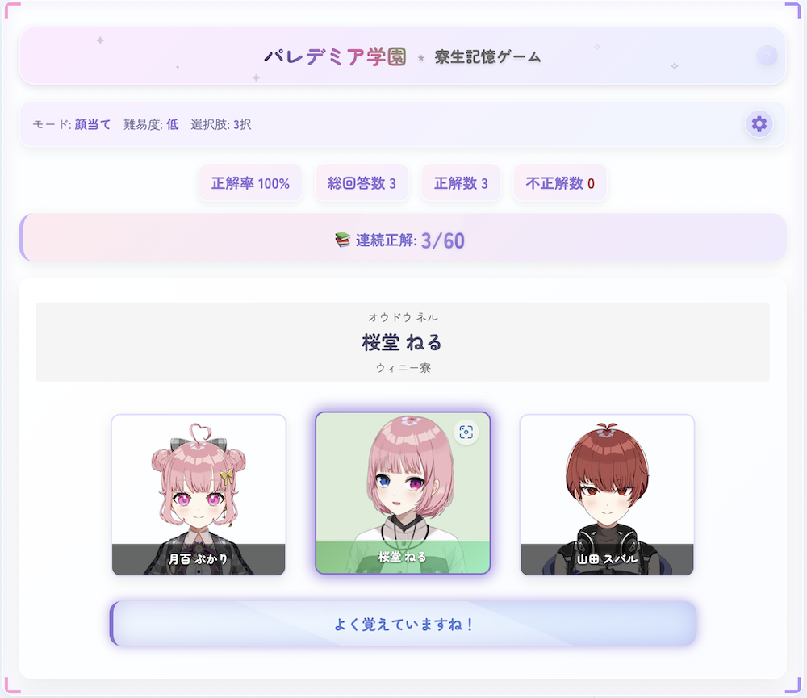

# パレデミア学園 寮生記憶ゲーム

## 概要

このゲームは、パレデミア学園の 60 名のタレントの顔と名前を楽しく覚えるためのメモリーゲームです。各寮 15 名ずつに分かれた寮生たちを記憶力を鍛えながら覚えましょう！



## 特徴

- **3 つのゲームモード**：

  - **顔当てモード**：タレントの名前が表示され、正しい画像を選ぶ
  - **名前当てモード**：タレントの画像が表示され、正しい名前を選ぶ
  - **誰の夢？モード**：タレントの夢が表示され、その夢を持つタレントを選ぶ

- **難易度設定**：

  - **難易度低**：ランダムな選択肢から正解を選ぶ
  - **難易度高**：似た髪色のタレントが選択肢に含まれ、より記憶力が試される

- **選択肢数調整**：2 つ、3 つ、4 つから選べる選択肢数

- **統計機能**：
  - 正解率トラッキング
  - 連続正解数の表示
  - 総回答数、正解数、不正解数の記録

## 4 つの寮について

パレデミア学園には、4 つの寮があります：

- **クゥ寮**：15 名のタレントが所属
- **ミュゥ寮**：15 名のタレントが所属
- **バゥ寮**：15 名のタレントが所属
- **ウィニー寮**：15 名のタレントが所属

## OGP 設定

このプロジェクトには、ソーシャルメディア共有用の OGP（Open Graph Protocol）設定が含まれています：

- **OGP 画像**: `assets/images/screenshot.png`を使用
- **OGP 情報**:
  - タイトル: パレデミア学園 寮生記憶ゲーム
  - 説明: パレデミア学園 60 名のタレントの顔と名前を覚えるための楽しいメモリーゲーム
  - URL: サイトの URL
  - タイプ: website

ソーシャルメディアでの共有時、パレデミア学園のゲームイメージが適切に表示されます。

## 遊び方

1. ゲームモード（顔当て/名前当て/誰の夢？）を選びます
2. 難易度と選択肢数を設定します
3. 問題に答えて、タレントの顔と名前、そして夢を覚えていきましょう
4. 連続正解を重ねて、寮生マスターを目指しましょう！

## 技術的な詳細

- 純粋な HTML/CSS/JavaScript で構築
- 外部ライブラリに依存しない軽量設計
- レスポンシブデザインでモバイルにも対応
- CSS の分割管理による効率的な開発・保守

## ファイル構成

```
parerdemia-quiz/
├── index.html        # メインのHTML
├── css/
│   ├── base.css      # 基本スタイル
│   ├── layout.css    # レイアウト
│   ├── components.css # コンポーネント
│   ├── game.css      # ゲーム固有のスタイル
│   ├── animations.css # アニメーション
│   └── responsive.css # レスポンシブデザイン
├── script.js         # ゲームロジック
├── assets/
│   ├── data/
│   │   └── talents.json  # タレントデータ
│   └── images/
│       └── face-*.webp    # タレント画像
└── .github/
    └── copilot-instructions.md  # 開発指示
```

## 実装済み機能
- 3つのゲームモード（顔当て、名前当て、誰の夢？）
- 3段階の難易度設定
- 選択肢数の調整（2択/3択/4択）
- 連続正解エフェクト
- 全タレント制覇時の特別アニメーション
- 設定の自動保存（LocalStorage）

## 今後の実装予定
- さらに詳細なタレント情報の表示機能
- 寮ごとや髪色ごとの学習モード
- タイムアタックモードの実装
- 成績のローカルストレージ保存
- 全タレント制覇時の特別アニメーション強化
- より洗練された UI/UX の改善

---

パレデミア学園のファンの皆さんに楽しんでいただけると嬉しいです。配信者の方々にもぜひプレイしていただき、タレントたちのことをもっと知って応援の気持ちを高めるためのツールとして活用していただければ幸いです！
